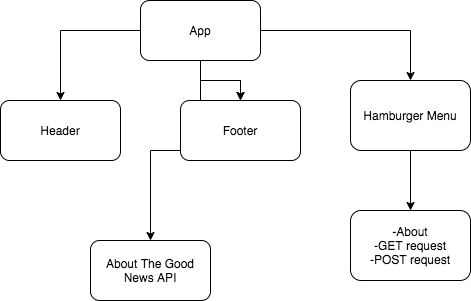

# _The Good News API_

#### _React website used to access the Good News API, and it's database of news articles that have a positive message., 3.6.2020_

#### By _**Will Quanstrom**_

## Description

_This website explains and allows for the use of the Good News API, an API that connects to a database that is full of positive, hopeful news articles._

## API Endpoints

_As of now, The Good News API can be access through the following URL: https://z756etr2ha.execute-api.us-east-2.amazonaws.com/production_

| PATH  | TYPE of REQUEST  | Description of Action |
|---|---|---|git 
| "/item"  | GET  | Will return all items in body  |   
| "/add"  | POST  | Will add a new artcle title to the database  |  

### Component Layout

## Setup/Installation Requirements

* _This is a great place_
* _to list setup instructions_
* _in a simple_
* _easy-to-understand_
* _format_

_{Leave nothing to chance! You want it to be easy for potential users, employers and collaborators to run your app. Do I need to run a server? How should I set up my databases? Is there other code this app depends on?}_

## Known Bugs

_None at this time._

## Support and contact details

_wquanstr215@gmail.com_

## Technologies Used

_The Good News API was built on AWS with their API Gateway. The API calls use Lamba function integration to interact with a DynamoDB which is also hosted by AWS._

_This website that allows for interaction with the API is built on React._

### License

*Permission is hereby granted, free of charge, to any person obtaining a copy of this software and associated documentation files (the "Software"), to deal in the Software without restriction, including without limitation the rights to use, copy, modify, merge, publish, distribute, sublicense, and/or sell copies of the Software, and to permit persons to whom the Software is furnished to do so, subject to the following conditions:

The above copyright notice and this permission notice shall be included in all copies or substantial portions of the Software.

THE SOFTWARE IS PROVIDED "AS IS", WITHOUT WARRANTY OF ANY KIND, EXPRESS OR IMPLIED, INCLUDING BUT NOT LIMITED TO THE WARRANTIES OF MERCHANTABILITY, FITNESS FOR A PARTICULAR PURPOSE AND NONINFRINGEMENT. IN NO EVENT SHALL THE AUTHORS OR COPYRIGHT HOLDERS BE LIABLE FOR ANY CLAIM, DAMAGES OR OTHER LIABILITY, WHETHER IN AN ACTION OF CONTRACT, TORT OR OTHERWISE, ARISING FROM, OUT OF OR IN CONNECTION WITH THE SOFTWARE OR THE USE OR OTHER DEALINGS IN THE SOFTWARE.*

Copyright (c) 2020 **_Will Quanstrom_**